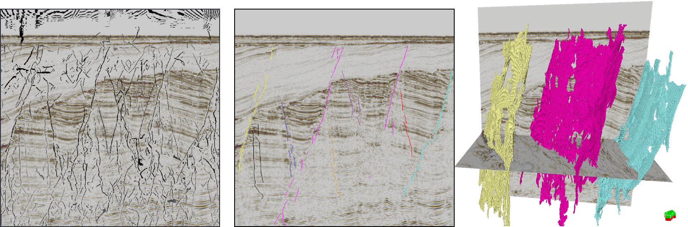

# 3D Fault Individualization

MATLAB code for fault individualization from 2017. The code is based on simple image processing tools to automatically filter, separate and extract individual 3D faults from a fault volume, such as a fault likelihood cube (Hale, 2013), or a fault volume resulting from supervised fault identification. 

*The method is described in Bugge et al., 2018:*
### Bugge, A. J., S. R. Clark, J. E. Lie, and J. I. Faleide, 2018, A case study on semiautomatic seismic interpretation of unconformities and faults in the southwestern Barents Sea: Interpretation, 6, SD29-SD40

The method for semi-automatic fault extraction is based on the assumption that each fault surface can be targeted as a 3D object in 
a binary representation of a fault volume. Prior to this, interference within the cube is addressed by separating intersecting faults through morphological filter operations and by assigning objects to different dip cubes. Objects that meet a set of user-defined filter criterions, related to size, are extracted from each of the dip cubes and assumed to represent individual fault surfaces.

  *Figure from Bugge et al., 2018. Automatically filtered and individualized faults from a 3D fault likelihood volumes (Hale, 2013). The figure to the right shows three individual fault surfaces after being exported to petrel. *

